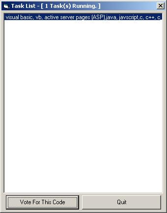



## TaskList

### Description

This simulates windows taskbar as every new window created , destroyed, activated , and even redraw or window caption change event is captured by this application. I was looking for this code for a long period but was unable to find a single project simulating the same i first manage to simulate this by enumerating windows through EnumWindows API call but one need to add a timer control to refresh the tasklist every now and then to get all the running tasks.But with this application no timer is running and you get notification for every window event whether explorer.exe is running or not it doesn't matters at all , which is very useful for shell developers who want to develop their own shell. try running this application as a shell and see for yourself. if you like this code or use this code then please do mention my name (if u like to) and dont forget to vote for this code as this takes months to figure out how to use those undocumented API's from windows.
 
### More Info
 

             |
---                |---
**Submitted On**   |2004-06-28 09:10:02
**By**             |[V2](https://github.com/Planet-Source-Code/PSCIndex/blob/master/ByAuthor/v2.md)
**Level**          |Advanced
**User Rating**    |4.1 (29 globes from 7 users)
**Compatibility**  |VB 6\.0
**Category**       |[Windows API Call/ Explanation](https://github.com/Planet-Source-Code/PSCIndex/blob/master/ByCategory/windows-api-call-explanation__1-39.md)
**World**          |[Visual Basic](https://github.com/Planet-Source-Code/PSCIndex/blob/master/ByWorld/visual-basic.md)
**Archive File**   |[TaskList1763236282004\.zip](https://github.com/Planet-Source-Code/v2-tasklist__1-54642/archive/master.zip)

